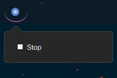
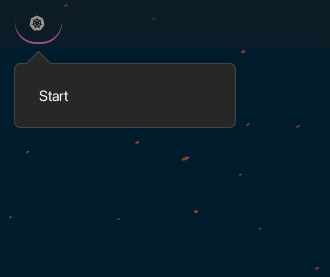

# kind-clusters-applet

Start a script to run my kind Clusters, not really usable for public consumption except to get code inspired

The idea was to have an icon because having my kind cluster running was consuming resources and always forget to shut them down.

And I can easily start and stop my dev environement launching a custom dev script.

In general this probably could get generalised for most use cases where users has a script to run a  script to stop and a check to make. I should probably try whenever I figure out how to make UI in JS (i already have hard time in programming language I am proficient with).

Most of that code has been adapted/ripped from the https://github.com/RedSoftwareSystems/easy_docker_containers extension.

## Start and Stop kind

* Cluster started look like this : 

  

* Cluster Stopped : 

  

