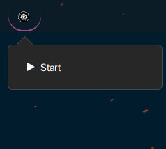

# kind-clusters-applet

Start a script to run my kind Clusters, not really usable for public consumption except to get code inspired

The idea was to have an icon because having my kind cluster running was consuming resources and always forget to shut them down.

And I can easily start and stop my dev environement, 

## Start and Stop kind

* Cluster started look like this : 

  

* Cluster Stopped : 

  

